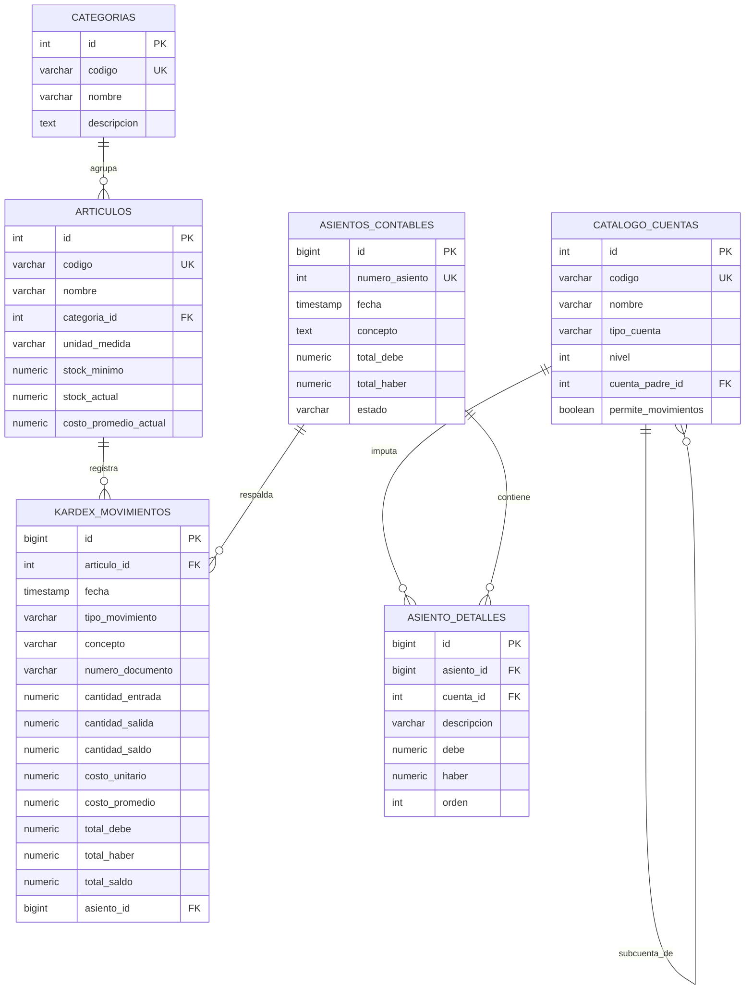

# Estructura de Base de Datos - Sistema Contable (.NET 8 / PostgreSQL)

Este documento contiene la arquitectura de base de datos relacional para el sistema contable y de inventarios (Kardex bajo método de **Costo Promedio Ponderado**).

---

## 1. Diagrama Entidad-Relación (ERD)



---

## 2. Scripts DDL en PostgreSQL

```sql
-- ==========================================================
-- 1. MÓDULO DE INVENTARIOS Y KARDEX
-- ==========================================================

-- Tabla de Categorías de Productos
CREATE TABLE IF NOT EXISTS categorias (
    id SERIAL PRIMARY KEY,
    codigo VARCHAR(20) UNIQUE NOT NULL,
    nombre VARCHAR(100) NOT NULL,
    descripcion TEXT,
    activo BOOLEAN DEFAULT TRUE,
    creado_en TIMESTAMP WITH TIME ZONE DEFAULT CURRENT_TIMESTAMP
);

-- Tabla de Artículos / Productos
CREATE TABLE IF NOT EXISTS articulos (
    id SERIAL PRIMARY KEY,
    codigo VARCHAR(30) UNIQUE NOT NULL,
    nombre VARCHAR(150) NOT NULL,
    descripcion TEXT,
    categoria_id INT REFERENCES categorias(id) ON DELETE SET NULL,
    unidad_medida VARCHAR(20) DEFAULT 'UND',
    stock_minimo NUMERIC(14, 2) DEFAULT 0.00,
    stock_actual NUMERIC(14, 2) DEFAULT 0.00,
    costo_promedio_actual NUMERIC(18, 4) DEFAULT 0.0000,
    precio_venta NUMERIC(14, 2) DEFAULT 0.00,
    activo BOOLEAN DEFAULT TRUE,
    creado_en TIMESTAMP WITH TIME ZONE DEFAULT CURRENT_TIMESTAMP
);

-- ==========================================================
-- 2. MÓDULO DE CONTABILIDAD
-- ==========================================================

-- Catálogo de Cuentas Contables
CREATE TABLE IF NOT EXISTS catalogo_cuentas (
    id SERIAL PRIMARY KEY,
    codigo VARCHAR(30) UNIQUE NOT NULL,
    nombre VARCHAR(150) NOT NULL,
    tipo_cuenta VARCHAR(20) NOT NULL CHECK (tipo_cuenta IN ('ACTIVO', 'PASIVO', 'PATRIMONIO', 'INGRESOS', 'COSTOS', 'GASTOS')),
    naturaleza VARCHAR(10) NOT NULL CHECK (naturaleza IN ('DEUDORA', 'ACREEDORA')),
    nivel INT NOT NULL DEFAULT 1,
    cuenta_padre_id INT REFERENCES catalogo_cuentas(id) ON DELETE RESTRICT,
    permite_movimientos BOOLEAN DEFAULT TRUE,
    activo BOOLEAN DEFAULT TRUE,
    creado_en TIMESTAMP WITH TIME ZONE DEFAULT CURRENT_TIMESTAMP
);

-- Asientos Contables (Libro Diario)
CREATE TABLE IF NOT EXISTS asientos_contables (
    id BIGSERIAL PRIMARY KEY,
    numero_asiento INT UNIQUE NOT NULL,
    fecha DATE NOT NULL DEFAULT CURRENT_DATE,
    concepto TEXT NOT NULL,
    tipo_asiento VARCHAR(20) DEFAULT 'DIARIO' CHECK (tipo_asiento IN ('APERTURA', 'DIARIO', 'AJUSTE', 'CIERRE')),
    total_debe NUMERIC(14, 2) NOT NULL DEFAULT 0.00,
    total_haber NUMERIC(14, 2) NOT NULL DEFAULT 0.00,
    estado VARCHAR(15) DEFAULT 'REGISTRADO' CHECK (estado IN ('BORRADOR', 'REGISTRADO', 'ANULADO')),
    creado_en TIMESTAMP WITH TIME ZONE DEFAULT CURRENT_TIMESTAMP
);

-- Detalle del Asiento Contable
CREATE TABLE IF NOT EXISTS asiento_detalles (
    id BIGSERIAL PRIMARY KEY,
    asiento_id BIGINT NOT NULL REFERENCES asientos_contables(id) ON DELETE CASCADE,
    cuenta_id INT NOT NULL REFERENCES catalogo_cuentas(id) ON DELETE RESTRICT,
    descripcion VARCHAR(200),
    debe NUMERIC(14, 2) NOT NULL DEFAULT 0.00,
    haber NUMERIC(14, 2) NOT NULL DEFAULT 0.00,
    orden INT DEFAULT 1,
    creado_en TIMESTAMP WITH TIME ZONE DEFAULT CURRENT_TIMESTAMP
);

-- ==========================================================
-- 3. MOVIMIENTOS KARDEX (COSTO PROMEDIO PONDERADO)
-- ==========================================================

CREATE TABLE IF NOT EXISTS kardex_movimientos (
    id BIGSERIAL PRIMARY KEY,
    articulo_id INT NOT NULL REFERENCES articulos(id) ON DELETE RESTRICT,
    fecha TIMESTAMP WITH TIME ZONE NOT NULL DEFAULT CURRENT_TIMESTAMP,
    tipo_movimiento VARCHAR(20) NOT NULL CHECK (tipo_movimiento IN ('INVENTARIO_INICIAL', 'COMPRA', 'VENTA', 'DEV_COMPRA', 'DEV_VENTA', 'AJUSTE')),
    concepto VARCHAR(250) NOT NULL,
    numero_documento VARCHAR(50),
    
    -- Control Físico (Unidades)
    cantidad_entrada NUMERIC(14, 2) NOT NULL DEFAULT 0.00,
    cantidad_salida NUMERIC(14, 2) NOT NULL DEFAULT 0.00,
    cantidad_saldo NUMERIC(14, 2) NOT NULL DEFAULT 0.00,
    
    -- Control Valorizado ($)
    costo_unitario NUMERIC(18, 4) NOT NULL DEFAULT 0.0000,
    costo_promedio NUMERIC(18, 4) NOT NULL DEFAULT 0.0000,
    total_debe NUMERIC(14, 2) NOT NULL DEFAULT 0.00,
    total_haber NUMERIC(14, 2) NOT NULL DEFAULT 0.00,
    total_saldo NUMERIC(14, 2) NOT NULL DEFAULT 0.00,
    
    -- Enlace con Asiento Contable (Opcional)
    asiento_id BIGINT REFERENCES asientos_contables(id) ON DELETE SET NULL,
    creado_en TIMESTAMP WITH TIME ZONE DEFAULT CURRENT_TIMESTAMP
);

-- Índices para optimización de consultas
CREATE INDEX IF NOT EXISTS idx_kardex_articulo_fecha ON kardex_movimientos(articulo_id, fecha);
CREATE INDEX IF NOT EXISTS idx_asientos_fecha ON asientos_contables(fecha);
CREATE INDEX IF NOT EXISTS idx_asiento_detalles_cuenta ON asiento_detalles(cuenta_id);
```

---

## 3. Datos Semilla de Prueba (Seed Data)

```sql
-- Categorías
INSERT INTO categorias (codigo, nombre, descripcion) VALUES
('CAT-01', 'Laptops y Cómputo', 'Equipos portátiles y accesorios'),
('CAT-02', 'Periféricos', 'Monitores, teclados y ratones')
ON CONFLICT (codigo) DO NOTHING;

-- Artículos
INSERT INTO articulos (codigo, nombre, categoria_id, unidad_medida, stock_minimo, stock_actual, costo_promedio_actual, precio_venta) VALUES
('ART-001', 'Laptop HP ProBook 450 G9', 1, 'UND', 5, 25.00, 788.0000, 950.00),
('ART-002', 'Monitor Dell 27" 4K', 2, 'UND', 10, 15.00, 320.0000, 420.00),
('ART-003', 'Teclado Mecánico Logitech MX', 2, 'UND', 8, 40.00, 85.5000, 120.00)
ON CONFLICT (codigo) DO NOTHING;
```

